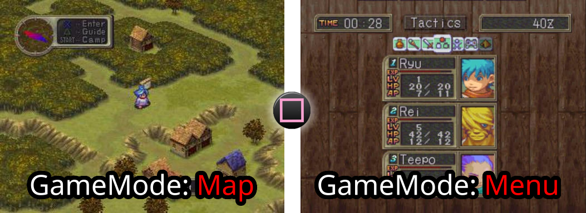
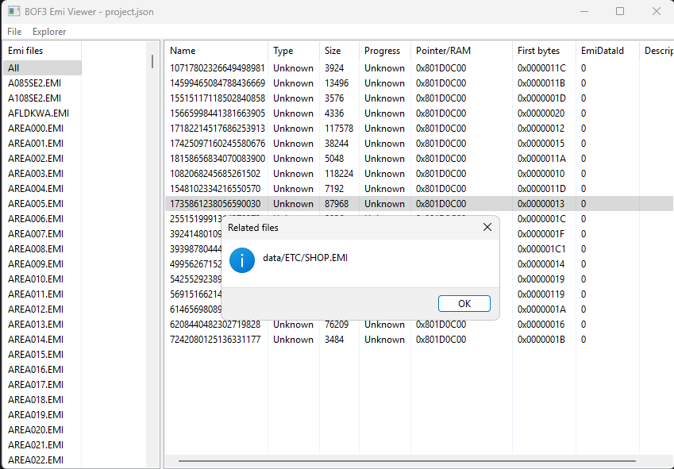
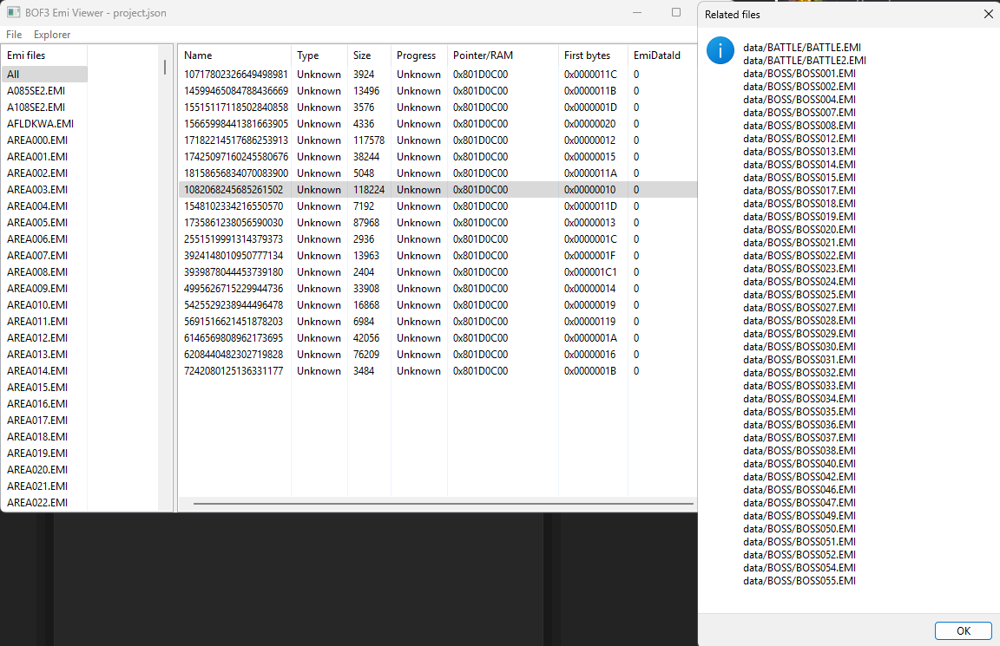

# GameMode executable

This document is still being researched and is not yet complete. 
This means that some information could be erroneous or simply missing.

**Table of content:**
1. [Introduction](#introduction)
2. [A GameMode is an executable](#a-gamemode-is-an-executable)
3. [How do I find and read these executables?](#how-do-i-find-and-read-these-executables)

-----------------------------------------------------------

## Introduction

Before we understand what this data is, we need to know what a GameMode is.

When you move around the map, you have access to a certain number of movements, you see the scenery scroll, ... 
When you press the `Square` button, the screen changes completely, and you find yourself in a menu, 
with specific actions, buttons, icons... You've just changed GameMode!

You've gone from GameMode `Map` to GameMode `StatusMenu`.

 
Switching game mode "Map" to "Menu"

But how does this change translate into game code?

## A GameMode is an executable
Each GameMode is its own executable and will describe:
- How the user interacts with this mode,
- How the screen should be drawn,
- Are there any particular sounds to play,
- ...

This division of the executable code is surprising at first glance, but it's very clever and allows for a clean division of the code.

## How do I find and read these executables?
These GameMode Executables are usually found at the beginning of certain EMI files (e.g. STATUS.EMI), and always have a RAM address of `0X801D0C00`.

The selected data is the "GameMode executable" of the Shop menu 
It appears only in one EMI file

These are `PSX/MIPS` executables, and you'll need a disassembler (compatible with this type of processor) to try and understand the code behind the mode, which is no easy task!

But the fact that it's broken down in this way gives strong clues as to the content of the code, and can in some cases make it easier to understand.

The selected data is the "GameMode executable" of the Battle mode 
It is used in every "Battle related" Emi file data!

