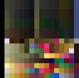

# Texture and Palette

<div class="warning">
This document is still being researched and is not yet complete. 
This means that some information is erroneous or simply missing.
</div>

**Table of content:**
1. [Introduction](#introduction)
2. [Texture](#texture)
3. [Palette](#palette)
4. [How palettes are used in textures](#how-palettes-are-used-in-textures)
5. [Todo - Missing elements](#todo---missing-elements)

-----------------------------------------------------------

## Introduction
Textures and palettes represent most of the visuals that will appear on screen:
- Characters, monsters, ...
- Texts and menus,
- Textures applied to 3D meshes,
- ...

In this document, we'll look at how these data are encoded and how they relate to each other.

## Texture
Textures in the [EMI files](1_TheEmiFiles.md) all seem to have the same `Data Type`, which is `3`.
They have no `header`, and no information about their width, height, bits per pixel and palette used.
There's only raw texture data.

> **Information**
>
> There are ways of finding this information relatively easily:
> - Find out what platform the game is running on (Playstation), and what formats are available on it,
> - Use raw image-reading software (such as [TileMolester](https://github.com/toruzz/TileMolester)),
>   and change the settings until you find the right format.

To compress textures size, a palette system (also known as [CLUT: Color Lookup table](https://en.wikipedia.org/wiki/Palette_(computing)))
allows you to use only a color index found in a table:
- If an image's pixels are encoded in 4 bits, then the image can contain 16 different colors,
- If an image's pixels are encoded in 8 bits, then the image can contain 256 different colors.

However, in BoF3, two formats in particular stand out:
- For textures encoded in **4 bits per pixel**, the **width is 128 pixels**,
- For textures encoded in **8 bits per pixel**, the **width is 64 pixels**.

> Keep in mind that there are other possible formats.

Textures can themselves be split into several tiles, with a size not specified in the data.
___(This information is probably hardcoded directly when the texture is used)___

## Palette
Palettes are used in textures to provide them colors. They are composed by multiple rows of colors.
The number of max rows possible in a palette is not defined, ___yet___.

Again, like textures, palettes does not have any header, but you can use the same tools to find their content.

<div style="text-align:center">
<br/>
<span style="font-style: italic">Example of a palette</span>
</div>

Most of the time, palettes are not too far from the textures they are used (in the same EMI file), but for a very few 
of them, they seem to be loaded once (___NEED TO BE CONFIRMED WITH MORE RESEARCH___).

Generally, when a palette is used:
- In a 4bpp texture: each row of this palette would be composed with 16 colors,
- In a 8bpp texture: ___NEED MORE INVESTIGATION___.

> Again, other formats are possible.

Now, each `Color` of the palette is encoded in 16 bits, (more info on [TIM_format](https://wiki.ffrtt.ru/index.php/PSX/TIM_format#CLUT_.28color_lookup_table.29)):

|       RED       |      GREEN      |       BLUE       | STP* |
|:---------------:|:---------------:|:----------------:|:----:|
| 0 to 4 (5 bits) | 5 to 9 (5 bits) | 10 to 14 (5bits) |  15  |

The `STP` is the "Special transparency processing": Because by default, the color `Black (r0, g0, b0)` is treated as 
transparent, unless the STP bit is set to 1.

Now, let's do some code! How to convert those 16 bits color to a more standard 24 bits ?
```c++
using u8 = uint8_t;
using u16 = uint16_t;

// A classic 24 bits color
struct ColorRgb
{
    u8 r{};
    u8 g{};
    u8 b{};
};

ColorRgb Convert16BitsTo24Bits(const u16 pixel)
{
    // I'm using at least C++20 here (https://en.cppreference.com/w/cpp/language/aggregate_initialization)
    // but you can initialize the old fashion way too.
    return
    {
        // ([SBBBBBGGGGGRRRRR] << 3) & 0xF8 = [BBBGGGGGRRRRR000] & [0000000011111000] = [RRRRR000]
        .r = static_cast<u8>((pixel << 3) & 0xF8),
        // ([SBBBBBGGGGGRRRRR] >> 2) & 0xF8 = [00SBBBBBGGGGGRRR] & [0000000011111000] = [GGGGG000]
        .g = static_cast<u8>((pixel >> 2) & 0xF8),
        // ([SBBBBBGGGGGRRRRR] >> 7) & 0xF8 = [0000000SBBBBBGGG] & [0000000011111000] = [BBBBB000]
        .b = static_cast<u8>((pixel >> 7) & 0xF8)
    };
}
```

You are now the master of colors!

## How palettes are used in textures
___TODO___

## Todo - Missing elements
___TODO___